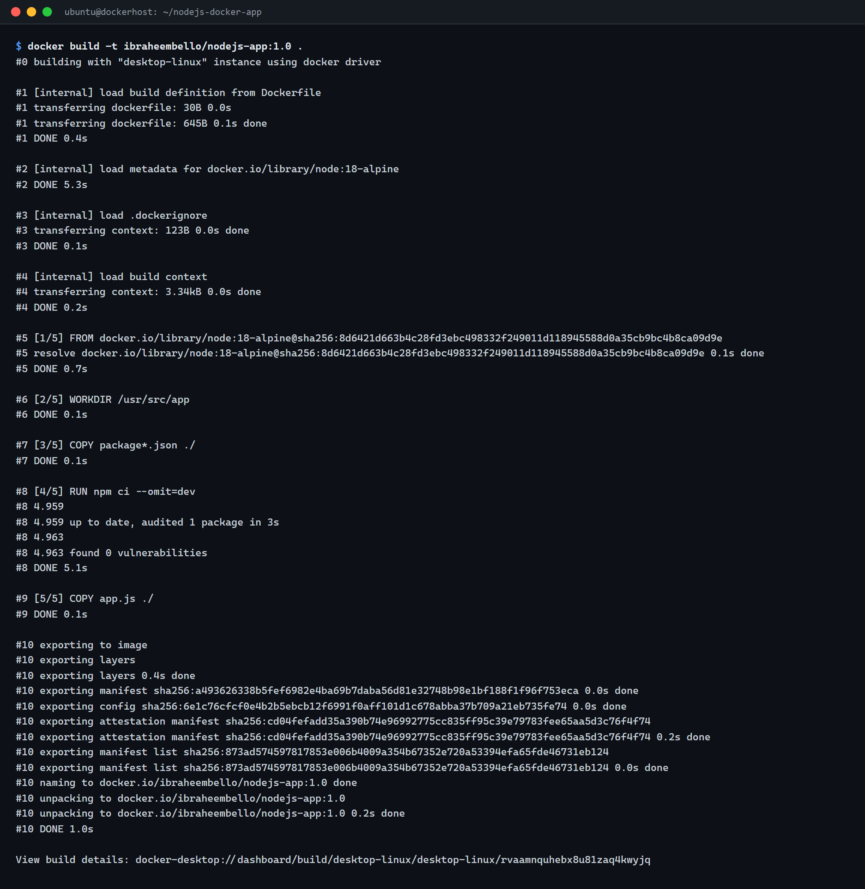
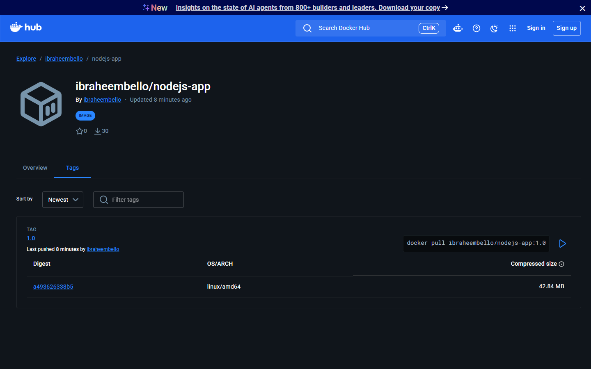
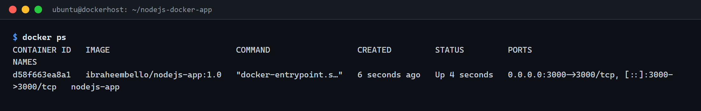
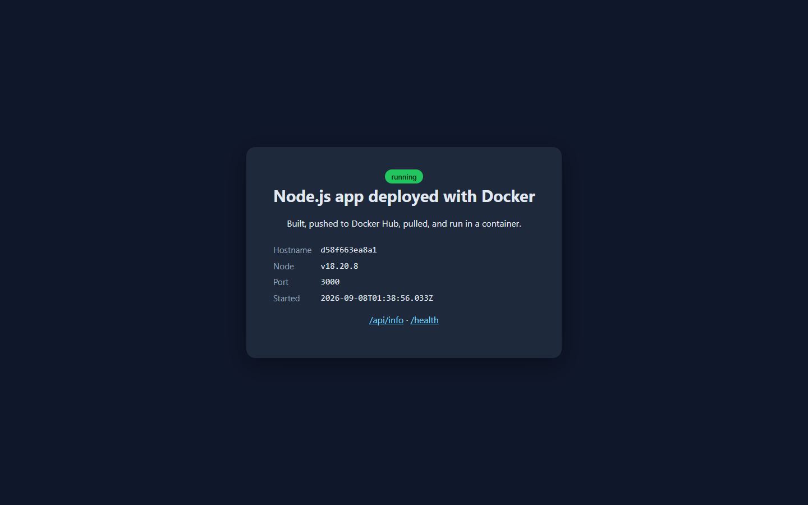

# Node.js on Docker

A minimal Node.js web app, containerized with Docker and published to Docker Hub.
It uses only Node's built-in `http` module, so the image contains no third-party
dependencies.

The app serves a small landing page plus two endpoints:

| Route       | Response                                  |
|-------------|-------------------------------------------|
| `/`         | HTML page showing host, Node version, port |
| `/api/info` | JSON with app metadata                     |
| `/health`   | JSON health check (`{"status":"ok"}`)      |

## Files

```
nodejs-docker-app/
├── app.js            # the HTTP server (built-in http module, no deps)
├── package.json      # metadata + start script
├── package-lock.json # pinned for reproducible npm ci
├── Dockerfile        # builds the container image
├── .dockerignore
└── README.md
```

## Live image

Published on Docker Hub: [`ibraheembello/nodejs-app:1.0`](https://hub.docker.com/r/ibraheembello/nodejs-app)

## Run locally (without Docker)

```bash
npm ci        # no runtime deps, but keeps installs reproducible
npm start     # serves on http://localhost:3000
```

## Run with Docker

Build the image (tagged with the Docker Hub username):

```bash
docker build -t ibraheembello/nodejs-app:1.0 .
```

Push it to Docker Hub:

```bash
docker login
docker push ibraheembello/nodejs-app:1.0
```

Pull and run it anywhere:

```bash
docker pull ibraheembello/nodejs-app:1.0
docker run -d -p 3000:3000 ibraheembello/nodejs-app:1.0
docker ps
```

Then open http://localhost:3000 (or `http://<server-ip>:3000`).

## Deployment screenshots

### 1. Docker image build

```bash
docker build -t ibraheembello/nodejs-app:1.0 .
```



### 2. Image on Docker Hub



### 3. Running container (`docker ps`)



### 4. Live application


